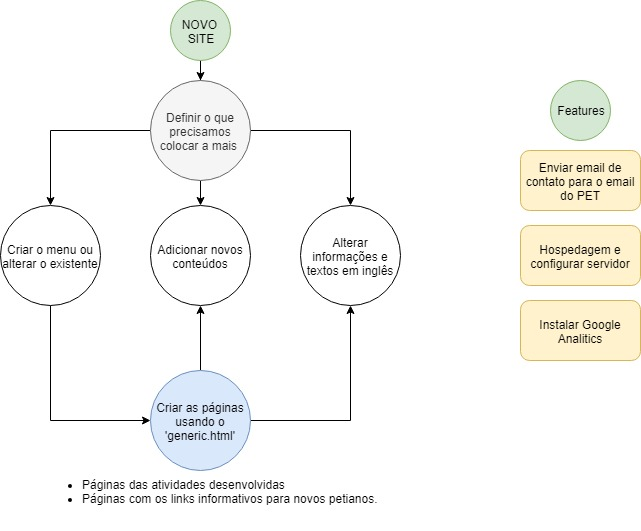

# The new website of comppet

## Information

- No use of frameworks like React/Angular/Vue/Svelte
- Simple use of HTML5, CSS3 and Javascript
- The production link for the site is: https://comppet-ufu.github.io/comppet/

## Get Started

### First
Clone this repo with git: `git clone https://github.com/comppet-ufu/comppet`

### Folder Structure

1. Assets: 
   1. > css : the main css and the styles for the website
   2. > js : the main js files and the libraries
   3. > sass : the preprocessor folder contain the scss files for estilization
   4. > webfonts : the fonts for the website
2. images  
   >the images and icons for the website
3. index.html
   > The main page for the project
4. generic.html
   > This page will serve with a layout for the next pages, like the information page or page with links for the new members of the CompPet

## Organization and elements of Project

## Methodology

We will create some issues in the repository and the members will discuss about the issue and resolve.

**Some simple Rules:**
- Never push directly to master, always create a merge request.
- Always wait for your merge request to be accepted, if needed, you may request an earlier code-review.

**The sequence to fix a issue or add a feature:**
1. Run `git pull origin master`
2. Create another branch with `git checkout -b Name_New_branch`
3. Resolve or create the feature and commit in this branch
Using (git `commit -m "mensagem sobre o que foi feito"`)
4. Create the Pull/Merge Request for the master branch and wait
Using: `git pull origin Name_New_branch`
5. Do the merge request in github website

Example:

1. **`git pull origin master`** - atualiza seu repositório local com a master do github
2. **`git checkout -b atualizar_readme`** - crio uma nova branch chamada atualizar_readme, onde irei criar essa nova funcionalidade ou atualizar a já existente.
3. Faço a funcionalidade e testo até que ela esteja funcionando completamente.
4. **`git status`** - verifico os arquivos que foram atualizados pelas minhas alterações.
5. **`git add *`** - adiciono os arquivos que modifiquei corretamente, uso o * para adicionar todos.
6. **`git commit -m "exemplo de atualizacao do readme"`** - comito as alterações adicionadas pelo git add, e escrevo uma mensagem descrevendo o commit.
7. **`git push origin atualizar_readme`** - envio a branch que eu criei para o repositório online, onde irei fazer um merge request com a branch principal.
8. Abra o website do github e deverá encontrar o seu merge request.

9. Envie o pull request, assine o seu pull request e adicione um revisor do código, no lado direito da tela.

10. Agora é só esperar o pull request ser aceito pelo revisor.

11. Observação: toda nova alteração no código, este processo deverá ser refeito.

## In the Future

We can talk about performance and automation of tasks like optmization of images or minification of files.

We can move the project to a framework like React, Sapper or Vue.

## Deployment

In this moment, the site is hospeded by the gitHub Pages.
We have to analyze and deploy in our self server.

## Credits:
	Start Tempalte:
		Solid State by HTML5 UP (html5up.net )

	Icons:
		Font Awesome (fontawesome.io)

	Other:
		jQuery (jquery.com)
		Scrollex (github.com/ajlkn/jquery.scrollex)
		Responsive Tools (github.com/ajlkn/responsive-tools)
		TypeIt (https://github.com/alexmacarthur/typeit)

## Help

Learn about github with: 
[Github-Training](https://lab.github.com/githubtraining/introduction-to-github)

Quick Guide (pt-br)
[Tutorial](https://rogerdudler.github.io/git-guide/index.pt_BR.html)

## Open Tasks

- [ ] Adicionar Informações Sobre as Iniciações Científicas de cada petiano.
- [X] Criar página para adicionar os formulários de Iniciação Científica. E adicionar os formulários.
- [X] Criar página com as informações de extensão.
- [X] Criar página para divulgar as ativades de Ensino.
